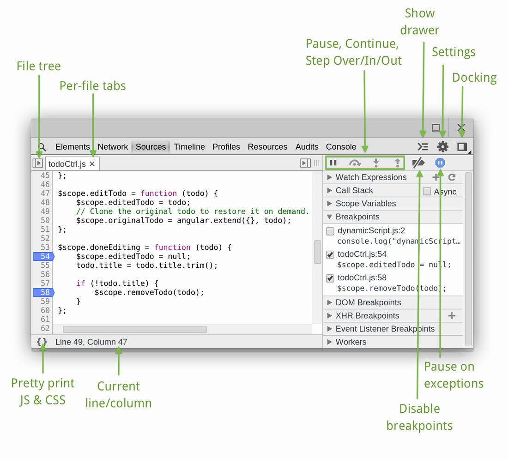

# Using breakpoints

Browsers provide powerful development tools that help debug errors or issues on a website. A complex webpage can consists of, multiple XHR request, DOM modification, and javascript across multiple files or domains. It is important to be aware of some of these debugging tools that are provided, to help locate errors or problems that may arise. One of the ways we can inspect or evaluate code is by using breakpoints. By using breakpoints, we can pause the execution of javascript at certain points and evaluate the code. By using breakpoints we can determine useful information such as the order of execution for functions, evaluate of variables and scope, and event detect DOM modification by script. Most browsers provide breakpoint tools, but below you can find information on using it on Chrome.

### Helpful Links

[Chrome devtools tips and tricks](https://developer.chrome.com/devtools/docs/tips-and-tricks)

[Chrome devtools javascript debugging](https://developer.chrome.com/devtools/docs/javascript-debugging)
